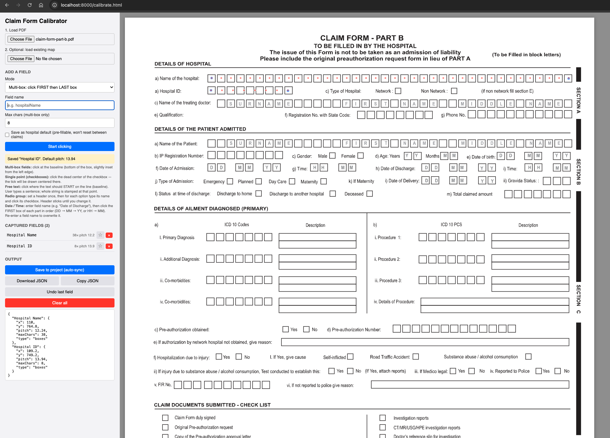
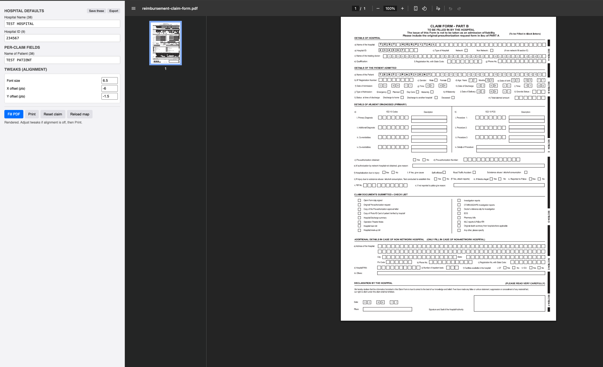
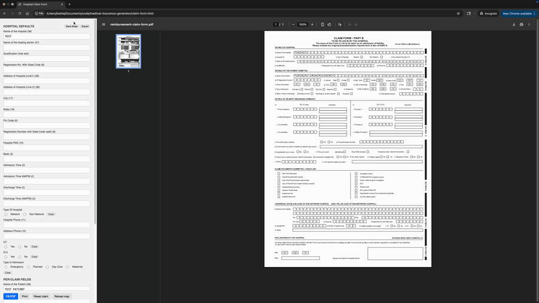

# PDF Form Filler

Fill out paper-style PDF forms by typing into a web page instead of writing by hand. Built especially for forms with little boxes for each letter — the kind hospitals, government offices, and insurance companies hand out.

**After a one-time setup, the daily experience is simple: open a file, type the details, print. No internet, no installations, no technical knowledge needed.**

## Why this exists

Many official PDF forms can't be typed into directly — they're scans or locked print-only files. The usual options are:

- Print and write on it by hand (slow, messy, easy to make mistakes)
- Buy Adobe Acrobat Pro (expensive)
- Pay someone to add fillable fields (too much hassle for one form)

This tool is a fourth option: type into a simple form on screen, the tool fills in your PDF, you print it.

## Screenshots


*Calibrator: click once on each field to record where it lives on the page.*


*Filler: type into the form on the left, the PDF on the right updates as you type.*


*Quick demo: filling a form and printing.*

## Two phases — and they are very different

| | **Setup phase** | **Daily-use phase** |
|---|---|---|
| **Who does it** | A tech-savvy person (developer, IT helper, son/daughter) | Anyone — no tech skills needed |
| **What you need** | A computer with Python and a browser | Any computer with a browser |
| **Internet?** | Yes (just to download once) | **No, ever** |
| **Time required** | About 30 minutes, only the first time | A minute or two, per filled form |
| **Result** | One small file you hand off | A printed, filled-in form |

The setup produces a single file. After that, the person filling forms never touches Python, never goes online, never installs anything. They double-click the file and type.

---

## For the daily user — how to fill forms

You'll need this **only once you've been given the file** by whoever set things up. From then on:

1. **Save the file** they sent you anywhere on your computer (Desktop is easiest).
2. **Double-click the file.** It opens in your browser like a web page.
3. The repeating fields (organization name, address, contact info, etc.) are **already filled in**.
4. **Type the details that change** — names, dates, and so on. The preview on the right updates as you type.
5. **Click Print** and pick your printer.

Repeat for every form. That's the whole workflow.

A few useful notes:

- You can do this on any computer with a modern browser — Windows, Mac, anything. Even an old laptop.
- You can be completely offline. Wi-Fi off, ethernet unplugged, doesn't matter.
- If you close it by accident, just double-click again — your saved info is remembered.
- If you make a mistake before printing, click **Reset form** to clear the variable details (your saved info stays).

That's all. No more reading needed if you're just filling forms.

---

## For the setup person — one-time setup per form

Now the technical part. You do this **once** for a given form, then hand off the result and you're done. If the form changes, repeat. Otherwise this section is irrelevant after day one.

### What you need

- **Python 3** — already on macOS and Linux; free download from [python.org](https://www.python.org/downloads/) for Windows
- **A modern browser** — Chrome, Edge, Firefox, or Safari from 2021 or later
- **About 30 minutes** for your first form

### Setup steps

```bash
git clone https://github.com/kesha-shah/pdf-form-filler.git
cd pdf-form-filler
# Place your blank PDF inside the folder, named claim-form-part-b.pdf
python3 serve.py
```

Now open your browser to the addresses below.

### Step 1 — Calibrate the form

Open http://localhost:8000/calibrate.html. Click **Load PDF** and choose your blank form.

For each field on the form, pick what kind of field it is, give it a name, and click on the right spot:

| Field type | When to use it | Clicks |
|---|---|---|
| Multi-box (first + last) | A long row of boxes — the first one tells the tool the spacing | 2 |
| Multi-box (first only) | More rows of boxes with the same spacing as before | 1 |
| Single point | A single checkbox | 1 |
| Radio group | Multiple checkboxes where you pick one (e.g. Gender, Yes/No) | 1 per option |
| Date | DD / MM / YY in three small boxes | 3 |
| Time | HH : MM in two small boxes | 2 |
| Free text | Plain text on a writing line | 1 |

Tick the **"Same on every form"** box for fields you'll always fill in the same way (organization name, address, phone, etc.). Click **Save to project** when done.

### Step 2 — Test the filler

Open http://localhost:8000/filler.html. The page shows a form built from your calibration, split into two parts:

- **Same on every form** — the fields you marked. Fill these once, click **Save these**, they're remembered.
- **Different each time** — the fields you fill fresh for each new form.

Type some test values. The PDF on the right updates instantly. If text sits a bit off inside the boxes, use the **Tweaks** panel:

- **Font size** — try 6.5 to 8 depending on box size
- **X / Y offset** — nudge text horizontally and vertically until it sits cleanly inside the boxes

### Step 3 — Pack your saved info into the file

In the filler, click **Export** next to **Save these**. A file called `defaults.json` downloads. Move it into the project folder, then run the bundler:

```bash
mv ~/Downloads/defaults.json .
python3 bundle.py
```

You'll get `claim-form.html` — a single file (about 700 KB) with everything inside it: the blank PDF, the field positions, the code that does the filling, and your saved info.

### Step 4 — Hand off

Send `claim-form.html` to the daily user — email, USB stick, anything. They save it, double-click, fill, print. That's the whole handoff. They never need to know any of the steps above.

---

## Using it for a different form

The tool isn't tied to any specific PDF. To set it up for another form:

1. Place your blank PDF in the project folder
2. Run the calibrator and click through the new fields
3. Mark the always-the-same fields with the ★ in the sidebar
4. Run the bundler

Each form you set up produces its own bundled file you can hand off independently.

## Browser support

Works in:
- Chrome and Edge — 2021 or later
- Firefox — 2021 or later
- Safari — late 2020 or later

**Does not work in Internet Explorer.** IE was retired in 2022. On older Windows machines, install Chrome (free, takes a couple of minutes).

## A note about printing

When the daily user clicks **Print**, their browser's print dialog opens. They can pick any printer or save it as a PDF for their records.

If they opened the file by double-clicking it (rather than through a local server), clicking **Print** opens the filled PDF in a new tab — they then press **Ctrl+P** there. This is normal browser behaviour and is documented in the on-screen status message.

## How it works under the hood

For developers who want to fork or modify:

- Plain HTML, CSS, JavaScript — no frameworks, no build step
- Drawing on the PDF is done by [pdf-lib](https://pdf-lib.js.org), embedded in the final bundle
- All your data lives in two places: `field-map.json` (field positions) and your browser's local storage (your saved info)
- `serve.py` is a tiny web server that lets the calibrator save files to disk during setup
- `bundle.py` reads the source files and produces one self-contained HTML by embedding everything inside

## Contributing

Pull requests welcome. Some ideas:

- Per-field text offsets (alignment is currently global)
- Multi-page PDF support (current code assumes one page)
- Validation hints (digit-only fields, date sanity, etc.)
- A first-time tour to guide new users through the calibrator

## License

MIT — see [LICENSE](LICENSE).
